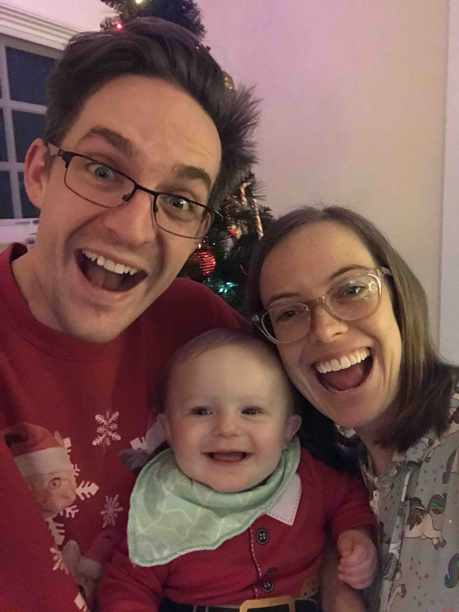

Hey there!

A few things about myself that may interest you. 

I come from a small clan of 6 boys. (yeah I know, my poor mother) I come 5th in the line up having one younger brother. 

In August 2018 I returned from serving in tri-cities Washington as a missionary for The Church of Jesus Christ of Latter Day Saints.

After coming back from my mission I started school at Brigham Young University in Provo Utah. I am studying Chemical Engineering and it has been awesome so far! 

For my career I hope to work on some of our energy production issues here in the United States. Particularly I want to help design and build the next generation of power plants that will be productive, safe, and reduce overall pollution. 

For personal interests, I am an avid hiker and lover of Ultimate Frisbee and the outdoors. I have plans to hike the Appalachian Trail in the summer of 2020 so stay tuned for updates on those plans. 

